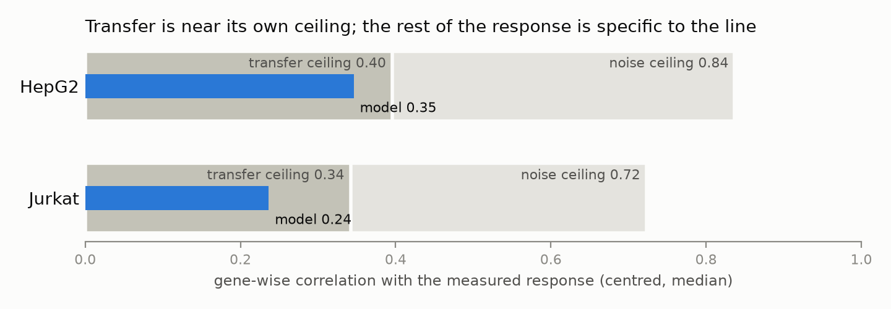

# Zero-shot perturbation response prediction, with a confidence score per prediction

Given only the resting state of a cell line it has never seen perturbed, can a model predict what each CRISPRi knockdown will do to it, and say which of its predictions to trust?

This is the problem posed by the [2026 Virtual Cell Challenge](https://arcinstitute.org/news/virtual-cell-challenge-2026) (Arc Institute; task paper in [*Cell*](https://www.cell.com/cell/fulltext/S0092-8674(26)00931-1)): predict knockdown responses in six cell lines whose perturbation data are hidden, from their unperturbed expression alone. A 2025 *Nature Methods* study showed that deep-learning and foundation models [do not yet beat simple linear baselines](https://doi.org/10.1038/s41592-025-02772-6) at predicting perturbation effects. This repository therefore starts from strong transfer baselines, measures why transfer fails across cell contexts, and evaluates candidate uncertainty scores so that a user knows which knockdowns the model is guessing at.

Built from September 2026 onwards, at the start of my M1, and still in progress: the final test set is released on 22 October 2026.

## Results



**The headline finding so far.** Two ceilings, both measured from the data. The *noise ceiling* is the best gene-wise agreement any prediction could reach against a response measured from 50 to 100 cells. The *transfer ceiling* is what a perfect copy of another cell line's response to the same knockdown would reach: noise-corrected, the same knockdown's response correlates only about 0.47 between HepG2 and Jurkat. Transfer models are already close to that limit (HepG2 0.35 of 0.40), and the gap up to the noise ceiling is response that is specific to the line. That explains why seven rounds of reweighting, rescaling and source selection stalled, and it says where the next gain has to come from. Details: the noise-ceiling and transfer-ceiling sections below (`scripts/10`, `12`, `14`).

### Challenge leaderboard (validation contexts A to C)

Scores are the organisers' baseline-normalised metrics (0 = matches their reference baseline, negative = worse). `results/tables/leaderboard.csv` keeps every entry.

| Entry | Rank | Overall | pds | mse | nmae | fid | reach | jac |
|---|---|---|---|---|---|---|---|---|
| mean transfer, 4 screens (25 Sep) | 572 | 0.069 | 0.40 | 0.00 | 0.014 | −0.05 | 0.08 | −0.02 |
| calibrated transfer, 4 screens (25 Sep) | 605 | 0.056 | 0.29 | 0.00 | 0.012 | −0.02 | 0.08 | −0.02 |
| weighted transfer, 6 screens (26 Sep) | 559 | 0.079 | 0.42 | 0.00 | **0.095** | −0.18 | 0.16 | −0.02 |
| **norm-restored transfer, 6 screens (29 Sep)** | **524** | **0.099** | **0.45** | 0.00 | 0.034 | **−0.05** | **0.17** | **−0.01** |

The first two entries used only the genes shared by all four public screens (6,203 of the 18,533 panel genes) and specific effects from K562 alone. The third adds the two X-Atlas screens (every target measured in at least 3 lines, 18,291 genes predicted) and weights sources by basal similarity. Fold-change accuracy and direction reach rose, direction fidelity fell, the same trade the local benchmark shows when sources are added (below). The fourth restores the magnitude that averaging removed (norm-restored transfer, below): direction fidelity recovered most of what it had lost (−0.18 to −0.05), discrimination and reach rose, fold-change accuracy gave back part of its gain, and the `mse` term stayed at 0.00 as it has for every entry. The local benchmark predicted the fidelity and reach gains and the `mse` cost; it did not predict the `nmae` drop (locally `nmae` improved slightly), a reminder that the organisers' normalised metrics and the raw local ones do not move one for one.

### Coverage: what the data can and cannot support

`scripts/07_coverage_audit.py` maps every panel gene and every challenge target to the sources that measured it ("not measured" is NaN throughout, never zero):

| | Genes | Targets |
|---|---|---|
| Challenge panel | 18,533 | 300 |
| Detected (at least 1% of control cells) | 13,859 | |
| Measured in at least one of the four essential or genome-wide screens (Replogle K562/RPE1, Nadig HepG2/Jurkat) | 10,917 | 272 (all K562-only) |
| Measured in at least one of six screens (adding X-Atlas HCT116/HEK293T) | **18,291** | **300** (each in at least 3 lines) |
| Measured in all six | 6,199 | 0 |
| Detected but measured nowhere | 96 | 0 |

The 300 validation targets are non-essential genes: none is in the 2,393-gene essential libraries used for RPE1, HepG2 and Jurkat, so with those four screens the target-specific signal came from a single line. The two genome-wide X-Atlas/Orion screens (HCT116 and HEK293T, [Huang et al. 2025](https://doi.org/10.1101/2025.06.11.659105), CC BY-NC-SA 4.0) close that gap. `scripts/00_xatlas_pseudobulk.py` streams their 126 GB release batch by batch into pseudobulk contexts and a fixed evaluation subset of cells, keeping under 1 GB on disk.

### Local benchmark (raw `cell-eval2` metrics, 200 held-out perturbations per line)

Held-out lines are scored on every gene they released (HepG2 9,624; Jurkat 8,882; HCT116 19,202); sources contribute all genes they measured. Hyper-parameters were chosen by the leave-one-source-out rule (`src/zsp/loso.py`) before any of these scores was seen. Higher is better except `mse` and `nmae`; 95% bootstrap CIs over perturbations are in `results/tables/local_benchmark.csv`.

**Six screens (five sources per held-out line):**

| Held out | Model | pds | mse | nmae | fid | reach | jac |
|---|---|---|---|---|---|---|---|
| HepG2 | mean transfer | 0.83 | **0.85** | 0.83 | 0.31 | 0.43 | **0.16** |
| HepG2 | weighted transfer | 0.83 | 0.89 | 0.81 | 0.38 | 0.46 | 0.13 |
| HepG2 | weighted median | **0.84** | 0.97 | 0.87 | 0.28 | 0.36 | 0.11 |
| HepG2 | norm-restored transfer | 0.83 | 1.00 | **0.80** | **0.44** | **0.51** | 0.13 |
| Jurkat | mean transfer | 0.84 | 1.22 | 0.82 | 0.29 | 0.46 | 0.11 |
| Jurkat | weighted transfer | **0.84** | 1.25 | 0.81 | 0.33 | 0.49 | 0.12 |
| Jurkat | weighted median | 0.84 | **1.22** | 0.85 | 0.24 | 0.40 | 0.10 |
| Jurkat | norm-restored transfer | 0.84 | 1.73 | **0.80** | **0.50** | **0.55** | **0.13** |

Going from three to five sources cut mean transfer's expression error (HepG2 1.03 to 0.85, Jurkat 1.90 to 1.22) and lowered its direction fidelity (0.45 to 0.31, 0.49 to 0.29): averaging more lines shrinks the magnitudes the DE tests need. Weighting sources by basal similarity recovers part of that fidelity in both lines; it is the model behind the rank-559 entry.

**Restoring the magnitude is the round-4 result.** Averaging five sources gives the right direction but a shrunken response. Rescaling each target's consensus response to the size a single source typically shows (norm-restored transfer) raises direction fidelity from 0.31 to 0.44 on HepG2 and from 0.29 to 0.50 on Jurkat, raises reach by 0.08 to 0.09, and lowers `nmae` in both lines, at the cost of expression error (`mse` 0.85 to 1.00 and 1.22 to 1.73). The per-gene weighted median, the other way to keep a single source's magnitude, does not help: the median of five noisy responses is smaller than their mean, not larger. By the pre-registered summary (mean of the oriented metrics) norm-restored transfer beats weighted transfer on HepG2 (0.018 vs 0.016) and loses on Jurkat (−0.085 vs −0.047), entirely through `mse`. On the leaderboard the `mse` term reads 0.00 for every entry, so the trade was worth an entry there: it moved the rank from 559 to 524.

**Hold-out from another study: HCT116 (X-Atlas).** The four Replogle and Nadig screens share a lab lineage; HCT116 was produced by a different lab with a different protocol and chemistry, so holding it out (with HEK293T from the same release still among the five sources) asks whether transfer survives a change of study. Scored on 19,202 genes, 100 cells per perturbation:

| Held out | Model | pds | mse | nmae | fid | reach | jac |
|---|---|---|---|---|---|---|---|
| HCT116 | control | 0.51 | **1.45** | 1.02 | 0.06 | 0.28 | **0.37** |
| HCT116 | mean transfer | 0.64 | 5.16 | **0.74** | 0.49 | 0.59 | 0.23 |
| HCT116 | weighted transfer | **0.65** | 4.91 | 0.74 | 0.46 | 0.61 | 0.19 |
| HCT116 | weighted median | 0.61 | 5.12 | 0.77 | 0.41 | 0.58 | 0.19 |
| HCT116 | norm-restored transfer | 0.63 | 5.68 | 0.74 | **0.52** | **0.62** | 0.15 |

The round-4 models behave on HCT116 as they do on the other two lines: norm-restored transfer has the best direction fidelity and reach and the worst expression error, the median the weakest DE metrics.

Two things differ from HepG2 and Jurkat. First, gene-level agreement collapses. `scripts/08_response_scale.py` compares predicted and real pseudobulk log fold changes over expressed genes for every perturbation (`results/tables/response_scale_heldout.csv`); for the weighted transfer behind the rank-559 entry:

| Held out | Gene-wise Pearson r (median) | Predicted / real RMS | MSE-optimal multiplier for the prediction |
|---|---|---|---|
| HepG2 | 0.33 | 0.89 | 0.36 |
| Jurkat | 0.23 | 0.99 | 0.24 |
| HCT116 | 0.09 | 1.16 | 0.07 |

The predicted response on HCT116 has about the right size; it points the wrong way for most genes, and `mse` 5.2 (against 1.4 for predicting no change) is the cost of a right-sized wrong prediction, not of an overshoot. Where HCT116 does have significant DE genes, direction transfers: fidelity 0.49 and reach 0.59 are the highest of the three lines. Second, 73 of the 200 held-out perturbations have no significant DE gene at all in the real data, and `cell-eval2` scores an empty predicted set against an empty real set as a Jaccard of 1, which is where the control's 0.37 comes from; only 36 perturbations have enough real DE genes for `nmae`.

Part of this is the screen, not the cell line. The same script measures each source's own response (`results/tables/response_scale_contexts.csv`):

| Screen | Study | Cells per target (median) | Knockdown depth (median own-gene log2 FC) | Response size (median RMS log2 FC, expressed genes) |
|---|---|---|---|---|
| K562 | Replogle 2022 | 179 | −1.33 | 0.09 |
| RPE1 | Replogle 2022 | 73 | −1.85 | 0.32 |
| HepG2 | Nadig 2025 | 46 | −1.71 | 0.23 |
| Jurkat | Nadig 2025 | 83 | −1.74 | 0.19 |
| HCT116 | X-Atlas 2025 | 152 | −0.39 | 0.09 |
| HEK293T | X-Atlas 2025 | 201 | −0.33 | 0.08 |

The X-Atlas knockdowns remove about a quarter of the target transcript where the other screens remove two thirds or more, so their downstream responses are a fraction of the size and, at 100 cells per perturbation, close to pseudobulk noise (the RMS column includes that noise, which is why the 46-cell HepG2 screen reads larger than K562). A line from a shallow-knockdown screen is a hard target for transfer from deep-knockdown screens, and a shallow-knockdown screen is a weak source; HEK293T is among the sources for every line here.

**How much of the direction error is fixable? A noise ceiling.** A held-out line's measured response is itself an estimate from 50 to 100 cells, so a perfect model could not reach r = 1 against it. `scripts/10_noise_ceiling.py` splits each perturbation's cells, and the control cells, into two disjoint halves, correlates the two halves' log fold changes gene by gene, and turns that into the highest correlation a noise-free prediction could reach (Spearman-Brown, then square root; `src/zsp/ceiling.py`, tested on simulated counts). "Centred" subtracts the mean response over all evaluated perturbations first ([Viñas Torné et al. 2025](https://doi.org/10.1038/s41587-025-02777-8)); the challenge scores are anchored at a mean-response baseline, so that is the part that earns points.

| Held out | Noise ceiling (raw / centred) | Best model r (raw / centred) | Share of the ceiling reached (raw / centred) |
|---|---|---|---|
| HepG2 | 0.82 / 0.84 | 0.35 / 0.35 (norm-restored) | 48% / 40% |
| Jurkat | 0.73 / 0.72 | 0.25 / 0.24 (norm-restored) | 36% / 34% |
| HCT116 | 0.46 / 0.42 | 0.09 / 0.11 (weighted) | 24% / 27% |

Medians over 200 perturbations of each perturbation's own r and r / ceiling, expressed genes only (1,580 to 1,795 genes at CP10k >= 1); per-model rows and bootstrap CIs are in `results/tables/noise_ceiling_models.csv`. Two readings. First, the direction error is not measurement noise: every model recovers well under half of the reproducible gene-wise signal, so there is real headroom for information the sources do not carry. Second, the HCT116 ceiling itself is low (split-half r 0.12): with a quarter knockdown and 100 cells, most of that screen's response is not reproducible even within the screen, which bounds what any model can score there.

**The ceiling on transfer itself.** The noise ceiling says how well a perfect model could do; it does not say how well *transfer* could do, because a knockdown's true response may simply differ between lines. `scripts/12_transferability.py` measures that directly. Every cell of the four single-cell screens is assigned to one of two halves, and for each pair of lines and each knockdown both screened, the observed gene-wise correlation between the two lines' responses is corrected for measurement noise in both (Spearman's correction for attenuation, r_true = r_obs / sqrt(reliability_1 x reliability_2); knockdowns with a split-half reliability below 0.2 in either line are left out of r_true).

| Pair | Shared knockdowns (reliable) | Observed r, centred | Noise-corrected r, centred (IQR) |
|---|---|---|---|
| HepG2 / Jurkat | 2,387 (1,895) | 0.21 | **0.47** (0.29 to 0.63) |
| HepG2 / HCT116 | 64 (44) | 0.22 | 0.63 (0.42 to 0.71) |
| Jurkat / HCT116 | 64 (41) | 0.20 | 0.43 (0.36 to 0.59) |
| Jurkat / HEK293T | 64 (44) | 0.16 | 0.50 (0.29 to 0.65) |
| HCT116 / HEK293T | 250 (73) | 0.07 | 0.51 (0.18 to 0.72) |
| HepG2 / HEK293T | 64 (46) | 0.09 | 0.22 (0.10 to 0.51) |

The one well-powered pair says it plainly: measured without any noise, a knockdown's gene-wise response in one cell line correlates about 0.5 with its response in another, so roughly three quarters of the variance of a response is specific to the line it is measured in. That is the ceiling on the whole idea of transferring measured responses, and the models here are already close to it: norm-restored transfer reaches 0.48 of the HepG2 noise ceiling and 0.36 of Jurkat's, against a transfer ceiling near 0.5 (averaging five sources can do a little better than one, since their line-specific parts partly cancel). What is left is context-specific, which is why reweighting, rescaling and source selection (rounds 5 to 7) could not find it. The reliable subset is biased towards strong knockdowns, and the pairs other than HepG2/Jurkat rest on 64 or fewer knockdowns; `results/tables/transferability_perturbations.csv` has every knockdown.

**Round 5, a negative result: correcting for knockdown depth does not help.** `DepthAwareTransfer` tries the two obvious corrections, alone and together: multiply each source's weight by its depth to the power k (k = 1 or 2 down-weights the X-Atlas screens), or divide each source's response by its depth before averaging and restore the consensus to the sources' mean depth. The pre-registered leave-one-source-out rule scored every option below plain weighted transfer on every held-out line and chose k = 0 without normalisation, which is weighted transfer itself, so the cell-level benchmark rows for `depth_aware` in `results/tables/local_benchmark.csv` reproduce it within resampling noise. Mean of the oriented proxies over the three lines (`results/tables/loso_grid.csv`):

| | no normalisation | normalised by depth |
|---|---|---|
| k = 0 | **0.20** | −0.26 |
| k = 1 | 0.19 | −0.53 |
| k = 2 | 0.17 | −0.67 |

Normalising multiplies the shallow screens' responses by four to five, and what it multiplies is mostly pseudobulk noise. Down-weighting them removes the only measurements many targets have in a third line. The shallow screens are worth keeping at face value, and the fix for their noise is more cells, not a scale.

**Round 6, a null result: the target line's basal expression carries a real but small signal about which genes respond.** `BasalModulatedTransfer` bins every gene by how much more or less the target line expresses it at rest than the sources do (difference of log1p CP10k) and learns one multiplier per bin from the sources alone, leaving each source out in turn; the multipliers are normalised to a mean of 1 so the model can only redistribute the response across genes, never shrink it. The learned multipliers (`results/tables/basal_modulation_multipliers.csv`) say the signal exists: genes the target line expresses at least four-fold less than the sources get 0.1 to 0.2 of the consensus response, genes two- to four-fold less get 0.4 to 0.7, genes two- to four-fold more get 1.3 on HepG2 and Jurkat. But those genes carry little of the response, and the bulk of genes (within two-fold of the sources) keep a multiplier of 1.0, so the cell-level scores land inside the confidence intervals of weighted transfer on every metric and every line (direction fidelity +0.02 on HepG2 and Jurkat, −0.02 on HCT116) and the gene-wise correlation is unchanged at 0.33, 0.22 and 0.07. Silencing a gene's response because the new line does not express it is right, and it is not where the error is: the error is in genes both lines express, whose response the sources disagree about or do not measure.

**Round 7, a negative result: where sources disagree, the average beats the nearest source.** `AgreementTransfer` measures, for every target and gene, how far the sources agree on the direction of the response (weighted by basal similarity), keeps the weighted mean where agreement reaches a threshold, and otherwise takes the value of the most similar source that measured it, instead of an average that cancels towards zero. Mean of the oriented leave-one-source-out proxies over the three held-out lines (`results/tables/loso_grid.csv`):

| Agreement threshold | as predicted | size restored to the sources' norm |
|---|---|---|
| 0 (weighted transfer) | **0.20** | 0.19 |
| 0.5 | 0.17 | 0.18 |
| 0.75 | 0.16 | 0.17 |
| 1.0 (nearest source wherever any source disagrees) | 0.16 | 0.17 |

Every threshold above 0 scores lower on every line, so the rule chose weighted transfer itself and the cell-level rows reproduce it. Where the sources disagree on a gene, no single source, not even the most similar one, is a better guess for a new line than their average: the disagreement is mostly noise, and the average's shrinkage towards zero is the correct response to it. Together with rounds 5 and 6 this narrows the open problem: the direction error cannot be fixed by reweighting, rescaling or selecting among the six available screens, which means it needs information those screens do not contain.

**Round 8, pre-registered: the target line's unperturbed covariance carries a real knockdown signal, but it does not add to transfer.** Every model above uses the new line only through its *mean* basal profile. The fluctuation-response relation of statistical physics says that, near steady state, the response of gene g to a push on gene p follows Cov(g, p) / Var(p) in the unperturbed system, which the challenge's ~18,000 control cells per line allow to be estimated. `src/zsp/fluctuation.py` does so on the model's half of the held-out control cells (library size regressed out) and `scripts/11_fluctuation.py` runs the analysis fixed in advance in [`results/prereg/fluctuation_response.md`](results/prereg/fluctuation_response.md), including a disclosed exploratory look and a placebo (the covariance column of 20 random expressed genes).

| Held out | Targets the line expresses | r with the real LFC, target / placebo | Excess > 0 | One-sided p | Blend gain in centred r (95% CI) |
|---|---|---|---|---|---|
| HepG2 | 57 | 0.128 / 0.043 | 67% | 0.018 | −0.025 (−0.040 to −0.010) |
| Jurkat | 67 | 0.075 / 0.028 | 58% | 0.013 | +0.007 (−0.001 to 0.014) |
| HCT116 | 28 | −0.030 / −0.021 | 50% | 0.80 | −0.014 (−0.029 to −0.001) |

The primary hypothesis holds on the two deep-knockdown lines and not on the shallow X-Atlas line (HEK293T, used only for selection, agrees with HCT116): a knockdown's effect in a new line points, weakly but above placebo, along that gene's co-variation in the line's own unperturbed cells. Adding it to the transfer prediction does not help, so the secondary hypothesis fails. The addendum records a flaw in the pre-registered choice of the blend weight and shows that a corrected rule gives the same answer. The signal is about a third the size of transfer's (r 0.08 to 0.13 against 0.23 to 0.35) and covers only the third of targets a line expresses well enough to have a measurable variance.

**Round 9: two more source contexts, and a held-out line on the challenge's own platform.** Rounds 5 to 8 and the transfer ceiling all say the same thing: the missing information is context, not a better way to average six screens. Two public screens were added (`scripts/13_new_contexts.py`): the VCC 2025 H1 hESC CRISPRi screen (Roohani et al., Cell 2025; 300 targets, about 1,000 cells each, knockdown depth −2.7 log2) and genome-scale CRISPRi in primary human CD4+ T cells ([Zhu et al., Cell 2026](https://doi.org/10.1016/j.cell.2026.08.002); 11,154 targets, 282 of the 300 challenge targets; used from the authors' DE statistics, Stim48hr condition chosen in advance by basal similarity to the challenge contexts).

The source weights showed something the earlier benchmark could not. Softmax weights of basal similarity (temperature 0.1), per target line:

| Target | K562 | RPE1 | HepG2 | Jurkat | HCT116 | HEK293T | H1 | CD4 |
|---|---|---|---|---|---|---|---|---|
| HepG2 (held out) | 0.31 | 0.27 | | 0.24 | 0.11 | 0.07 | 0.00 | 0.00 |
| Jurkat (held out) | 0.31 | 0.21 | 0.20 | | 0.15 | 0.12 | 0.00 | 0.01 |
| Challenge context A | 0.03 | 0.01 | 0.01 | 0.13 | 0.11 | 0.13 | 0.25 | 0.33 |
| Challenge context B | 0.01 | 0.03 | 0.01 | 0.02 | 0.14 | 0.12 | 0.53 | 0.12 |
| Challenge context C | 0.02 | 0.02 | 0.02 | 0.02 | 0.17 | 0.10 | 0.49 | 0.16 |

The hidden challenge lines resemble the probe-based screens (H1, CD4; X-Atlas in between) far more than the 3' screens the local benchmark is built from, so basal similarity is partly a measure of assay chemistry. Two consequences. On HepG2 and Jurkat the new sources get almost no weight and change nothing (paired differences within 0.01 on every metric, `results/tables/round9_h1_paired.csv`). And the local benchmark had been answering an easier question than the leaderboard asks. H1, the only public screen on the challenge's own platform, was therefore held out as well (`scripts/13 h1_eval`: 12,000 control cells and up to 150 cells per target):

| Held out: H1 | pds | mse | nmae | fid | reach | jac |
|---|---|---|---|---|---|---|
| control | 0.48 | **1.01** | 1.00 | 0.00 | 0.12 | 0.020 |
| mean transfer | **0.78** | 1.61 | 0.93 | 0.42 | 0.27 | 0.035 |
| weighted transfer | 0.73 | 1.63 | 0.95 | 0.37 | 0.24 | 0.027 |
| norm-restored transfer | 0.77 | 2.30 | 0.95 | **0.47** | 0.27 | 0.044 |
| norm-restored transfer + CD4 | 0.76 | 2.12 | 0.94 | **0.47** | **0.29** | **0.046** |

Three readings. Transfer is much weaker on the challenge-like line than on HepG2 or Jurkat (reach 0.27 against 0.46 to 0.55, nmae 0.93 against 0.80). Weighting by basal similarity, chosen on the 3' lines, hurts here: weighted transfer is below plain averaging on every metric, consistent with the eight-source leave-one-source-out run preferring flatter weights. And CD4 helps a little, through norm-restored transfer only: against the same model without it (paired over 200 knockdowns, `results/tables/round9_h1_cd4_paired.csv`), nmae improves by 0.011 (CI 0.001 to 0.021) and jac by 0.002 (0.000 to 0.004), with reach +0.016 and pds −0.009 inside their CIs; averaged in plainly, the same source *lowers* fid by 0.028 (0.014 to 0.041), the dilution that norm restoration exists to undo. The rule fixed for the next leaderboard entry before these CD4 scores were read ([`results/prereg/v5_submission_rule.md`](results/prereg/v5_submission_rule.md)) required CD4 not to hurt on four of six metrics; it passes on five. The same file fixed the temperature to be chosen by the leave-one-source-out rule over all eight contexts (`scripts/06_fit_loso.py --challenge`); the proxy rises steadily as the weights flatten (0.168, 0.171, 0.173, 0.177 for temperatures 0.05, 0.1, 0.2 and equal weights), so v5 averages the eight sources' responses with equal weights before restoring the norm.

**Four screens (three sources per held-out line), all models:**

| Held out | Model | pds | mse | nmae | fid | reach | jac |
|---|---|---|---|---|---|---|---|
| HepG2 | control | 0.49 | 1.07 | 1.02 | 0.01 | 0.09 | 0.11 |
| HepG2 | mean transfer | 0.82 | 1.03 | **0.81** | **0.45** | 0.47 | **0.13** |
| HepG2 | weighted transfer | **0.83** | 1.04 | 0.82 | 0.41 | **0.48** | 0.13 |
| HepG2 | scaled (×0.4) | 0.79 | 0.88 | 0.90 | 0.08 | 0.29 | 0.11 |
| HepG2 | gene-scaled | 0.81 | 0.99 | 0.90 | 0.26 | 0.31 | 0.12 |
| HepG2 | calibrated (α 0.4) | 0.71 | **0.85** | 0.87 | 0.13 | 0.34 | 0.12 |
| Jurkat | control | 0.52 | 1.04 | 1.00 | 0.02 | 0.08 | 0.08 |
| Jurkat | mean transfer | **0.84** | 1.90 | 0.82 | **0.49** | 0.49 | 0.10 |
| Jurkat | weighted transfer | 0.83 | 1.64 | **0.81** | 0.45 | **0.51** | **0.11** |
| Jurkat | scaled (×0.4) | 0.80 | **0.98** | 0.90 | 0.09 | 0.33 | 0.08 |
| Jurkat | gene-scaled | 0.78 | 1.16 | 0.88 | 0.27 | 0.40 | 0.09 |
| Jurkat | calibrated (α 0.4) | 0.69 | 1.08 | 0.88 | 0.18 | 0.37 | 0.08 |

What the numbers say:

- **Transferring the measured response as-is is still the model to beat.** Every way of damping it (a global scale, per-gene transfer coefficients, or the generic/specific decomposition) lowers expression error (`mse`) at the cost of every DE-based metric, because those metrics come from significance tests that need the full magnitude. The leave-one-source-out proxies pointed the same way for `mse`, but four of the six proxies are scale-invariant, so the pre-registered rule chose the strongest damping and the cell-level scorer overrules it. A selection rule for this challenge has to include a magnitude-sensitive DE proxy.
- **Weighting sources by basal similarity is the one change that helps without a trade-off.** On Jurkat it cuts `mse` from 1.90 to 1.64 while matching or beating mean transfer on `reach`, `nmae` and `jac`; on HepG2 the two are within CI of each other on everything.
- **The "overshoot" on Jurkat is a direction problem, not a scale problem.** Mean transfer's expression error on Jurkat with three sources (1.90) was worse than predicting no change (1.04), which looked like responses that were too large. The response-scale audit (above) says otherwise: with five sources the predicted RMS is 0.96 of the real one, but the median gene-wise correlation is only 0.22, so the MSE-optimal multiplier is 0.24 (0.39 on HepG2), close to the 0.4 the leave-one-source-out rule chose for scaled transfer. Shrinking a partly wrong prediction lowers squared error while removing the magnitude the DE tests need. The fix this benchmark asks for is a better direction per context, which no model here provides.
- **None of five candidate uncertainty signals supports selective prediction.** Keeping the 50% most-certain targets changes every metric by less than 0.06 for every signal, averaged over the three held-out lines (`results/tables/uncertainty_gain_at_half_coverage.csv`); raw disagreement and effect magnitude lower `pds` when used for selection, because the targets sources agree on are the weak-effect ones. The rank correlations that looked promising in an earlier version of this benchmark were a magnitude confound, not a usable confidence score.
- **Pre-registered biology** (`results/prereg/biological_examples.md`, fixed before any per-target score was read): the four "shared-response" knockdowns (AARS, POP7, GTF3C6, ACTR2) did not transfer better than the four "context-dependent" ones (HSD17B12, GABPA, E4F1, GLB1), p ≥ 0.44 on every metric with n = 8 vs 8, and the "decline" rule (highest normalised disagreement, therefore lower `reach` and `jac`) was rejected: those targets scored higher on `reach` in HepG2 and Jurkat, and lower in HCT116 only by 0.06 (one-sided p = 0.23). All results are recorded as they came out (`results/tables/prereg_*.csv`).

## Data

Public genome-scale CRISPRi Perturb-seq screens, each reduced to per-perturbation pseudobulk profiles (mean raw UMI counts per cell) plus the non-targeting control profile:

| Context | Source | Perturbations | Role |
|---|---|---|---|
| K562 (CML) | [Replogle et al., 2022](https://doi.org/10.1016/j.cell.2022.05.013), genome-wide | 9,866 | training |
| RPE1 (retinal epithelium) | Replogle et al., 2022 | 2,393 | training |
| HepG2 (liver) | [Nadig et al., 2025](https://doi.org/10.1038/s41588-025-02169-3) | 2,393 | held-out (single cells kept for scoring) |
| Jurkat (T-ALL) | Nadig et al., 2025 | 2,393 | held-out (single cells kept for scoring) |
| HCT116, HEK293T | [Huang et al., 2025](https://doi.org/10.1101/2025.06.11.659105) (X-Atlas/Orion), genome-wide | see coverage table | training |

Contexts are aligned on their shared genes (Ensembl IDs). `scripts/download_data.sh` fetches everything from figshare and GEO (~16 GB, resumable).

## Local benchmark: the challenge replayed on public data

For each held-out line, the model sees the other contexts' full perturbation responses plus only the held-out line's non-targeting cells, which is exactly the information the challenge provides. Predictions are emitted as single cells (resampled from that line's own control cells, rescaled by the predicted fold change, integer-rounded) and scored with the organisers' own tool, `cell-eval2` under the `vcc2026` preset: the six competition metrics, unweighted. The held-out line's control cells are split in half, one half as the "basal state" the model is allowed to see and the other half reserved for scoring, so the scorer never sees a cell the model was given.

## Method

Every knockdown response in a source context is decomposed as

    LFC(p) = generic + specific(p)

where the generic response (the median LFC over all knockdowns) captures what every CRISPRi perturbation does to that cell line (stress, slowed proliferation, the cost of the machinery itself) and specific(p) is what the target does. The models compared:

| Model | Prediction for the unseen context |
|---|---|
| Control | no change (the floor every model must beat) |
| Mean transfer | average of the target's measured LFC across source contexts |
| Weighted transfer | the same average, weighted by each source's basal similarity to the target line (softmax of Pearson similarity, temperature chosen by the leave-one-source-out rule) |
| Norm-restored transfer | weighted transfer, then each target's response is rescaled so that its L2 norm equals the weighted mean of the source responses' norms: consensus direction, single-source magnitude |
| Weighted median transfer | per-gene weighted median of the source responses, same weights |
| Depth-aware transfer | weighted transfer with source weights multiplied by knockdown depth to the power k, and optionally each response divided by its screen's depth before averaging (negative result, round 5) |
| Basal-modulated transfer | weighted transfer, each gene multiplied by a factor learned for its bin of basal-expression difference between the target line and the sources; factors average 1 (null result, round 6) |
| Agreement transfer | weighted mean where the sources agree on a gene's direction, most similar source's value where they do not (negative result, round 7) |
| Scaled transfer | mean transfer times one global response scale (0.4 by the leave-one-source-out rule) |
| Gene-scaled transfer | mean transfer with a per-gene transfer coefficient, ridge-fitted across sources |
| Calibrated transfer | mean source generic + shrunk mean specific effect; genes not expressed in the target's basal state are gated to zero; the target's own transcript is set to the typical knockdown depth; uncertainty = disagreement between sources on the specific effect, inflated for targets few sources measured |

Everything is fitted on source contexts only; the held-out line contributes nothing but its basal profile.

## Design decisions

- **Scored by the organisers' code, not by a re-implementation.** `cell-eval2` is a dependency, the `vcc2026` preset is used verbatim, and the run log is kept beside every result.
- **No leakage from the held-out line.** Its perturbation cells are never read by any model; its control cells are split so the scorer's controls are disjoint from the model's.
- **Genes are indexed by symbol in every scored file**, because the scorer excludes each perturbation's own target gene by name; a silent mismatch would inflate scores, and the tool refuses to run rather than guess.
- **Uncertainty is evaluated, not only emitted.** Per-perturbation scores are joined with the model's uncertainty to ask whether it ranks its own failures (`scripts/04_*`).
- **Config-driven and tested.** Every number comes from `configs/default.yaml`; the pseudobulk, decomposition, transfer, gating and cell-emission steps have unit tests.

## Reproduce

```bash
uv sync
make data          # ~16 GB from figshare + GEO (resumable)
make contexts      # pseudobulk every screen
uv run python scripts/00_xatlas_pseudobulk.py --line HCT116   # streams ~47 GB, keeps ~1 GB
make coverage      # coverage map (results/tables/coverage_*.csv)
make loso          # pre-registered hyper-parameter selection on sources only
make benchmark     # leave-one-context-out, scored with cell-eval2 (~25 min per model and line)
make collect       # results/tables/local_benchmark.csv, with bootstrap CIs
make uncertainty   # candidate uncertainty signals vs per-target scores
make scale         # response-scale audit (knockdown depth per screen; predicted vs real magnitude)
make ceiling       # split-half noise ceiling for the gene-wise direction of every held-out line
uv run python scripts/11_fluctuation.py   # round 8: fluctuation-response test (pre-registered)
uv run python scripts/12_transferability.py   # noise-corrected cross-line agreement of knockdown responses
uv run python scripts/09_prereg_examples.py
make test
```

### Docker

```bash
docker build -t zsp . && docker run --rm -v "$PWD/data:/app/data" -v "$PWD/results:/app/results" zsp make test
```

## Limitations

- **Few source contexts.** Transfer quality is bounded by how many cell lines have measured a target; a target seen only in K562 is a K562 result, not a cross-context one.
- **The direction of the response is inherited, not adapted.** Every transfer model carries the sources' gene-wise response into the new line; the gene-wise correlation with the real response is 0.2 to 0.3 within a study and 0.1 across studies. Predicting which genes change in a new context from its basal state, rather than how much, is the main open problem.
- **Knockdown depth differs between screens.** The X-Atlas screens knock down about a quarter of the target transcript where the others remove two thirds or more, so their responses are smaller and noisier; a model that treats all sources as equally informative inherits that.
- **Released gene sets differ between screens** (8.2k to 9.6k genes each; 10,917 panel genes in at least one), so the local benchmark under-represents lowly expressed and lineage-specific genes; the challenge panel has 18,533.
- **Pseudobulk training discards cell-level structure.** Bimodal responses (a perturbation that only affects a subpopulation) are averaged away; the emitted cells inherit only the target line's basal heterogeneity.
- **Local scores are not leaderboard scores.** The challenge normalises each metric against organiser-built baselines and averages over three hidden lines; the local numbers here are raw `cell-eval2` metrics on public lines and are only comparable between models in this repository.
- **No validated uncertainty yet.** The five signals tried are all functions of the sources and the basal state; none ranks failures usefully. The analysis is kept so that the negative result stays visible.

## References

- Replogle et al., *Mapping information-rich genotype-phenotype landscapes with genome-scale Perturb-seq*, [Cell 2022](https://doi.org/10.1016/j.cell.2022.05.013).
- Nadig et al., *Transcriptome-wide analysis of differential expression in perturbation atlases*, [Nat Genet 2025](https://doi.org/10.1038/s41588-025-02169-3).
- Huang et al., *X-Atlas/Orion*, [bioRxiv 2025](https://doi.org/10.1101/2025.06.11.659105).
- Ahlmann-Eltze, Huber & Anders, *Deep-learning-based gene perturbation effect prediction does not yet outperform simple linear baselines*, [Nat Methods 2025](https://doi.org/10.1038/s41592-025-02772-6).
- Roohani et al., *Virtual Cell Challenge: Toward a Turing test for the virtual cell*, [Cell 2025](https://doi.org/10.1016/j.cell.2025.06.008); the 2026 edition, [Cell 2026](https://www.cell.com/cell/fulltext/S0092-8674(26)00931-1).

## License

MIT © 2026 Matin Gerami
